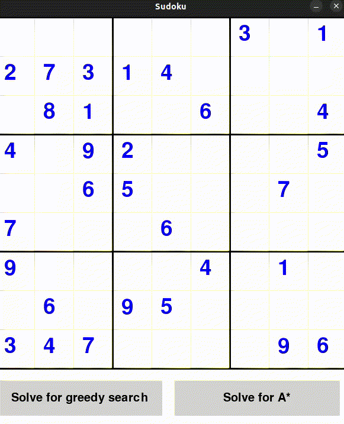

# Solving sudoku with heuristics algorithms
## Introduction
This repository contains a pygame implementation of a sudoku solver using heuristics algorithms. This project was made during the Artificial Intelligence course at the Pontifical Catholic University of Paraná (PUCPR). The algorithms used are:
### Greedy Search
Greedy search is a search algorithm that always chooses the best option available at the moment, without considering the future. In this case, for each empty cell, the algorithm will fill it with the first number that is not in the same row, column or block. If there is no number that satisfies this condition, the algorithm will backtrack to the previous cell and try another number. This algorithm is not optimal, but it is complete, as it was teached in the course.
### A*
Even though the greedy search is complete, it is not optimal. To solve this problem, the A* algorithm was implemented. This algorithm is similar to the greedy search, but it also considers the distance between the current cell and the goal. In this case, the distance is the number of empty cells in the sudoku. The algorithm also uses a priority queue to choose the next cell to be filled. The cell with the lowest distance to the goal is chosen first. This algorithm more optimal than the greedy search.
## How to run
To run the program, you need to have python 3 installed. You also need to install pygame. To install pygame, run the following command:
```
pip install pygame
```
After installing pygame, you can run the program by running the main.py file:
```
python main.py
```
or simply by running on the platform of your choice.
## Showcase
When running the code, it will generate a solvable sudoku game. You can play it normally:


But if you want to solve it using the algorithms, you can press either button on the bottom corner, and the algorithm will start solving the sudoku. The first button will use the greedy search, and the second button will use the A* algorithm.
### Solving with greedy search


### Solving with A*


## Conclusions
The greedy search is not optimal e usually slow, but it does the job of solving it. The A* algorithm is  faster and more optimal, as seen in the gifs.
The proposion of this project was to learn about heuristics algorithms, and it was achieved. The algorithms were implemented and tested, and the results were as expected.
